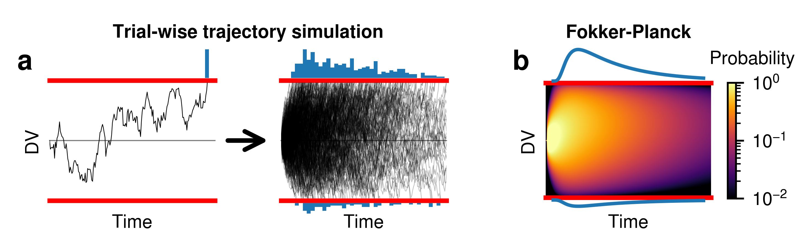

Fokker-Planck diagram
=====================

Summary
-------

Here, we will show how to build the schematic for Fokker-Planck, as seen in `Figure 3
<https://elifesciences.org/articles/56938/figures#fig3>`_ from `Shinn et
al. 2020 <https://elifesciences.org/articles/56938>`_.

Setting up the figure
~~~~~~~~~~~~~~~~~~~~~

First, we import the plotting libraries and define some basic properties:

.. literalinclude:: ../downloads/fokkerplanck.py
   :language: python
   :start-after: # Begin imports
   :end-before: # End imports

Next, we set up the canvas and define the three main axes we will use, the arrow
in between, and some basic axis labels.  Note that this does not yet define the
histograms/distributions shown on the top and bottom of these axes.

.. literalinclude:: ../downloads/fokkerplanck.py
   :language: python
   :start-after: # Begin set up canvas and axes
   :end-before: # End set up canvas and axes

Now, we create a function which will add histograms or plots of the pdf on the
top and bottom of these axes.  We set it up as a function which accepts the name
of the axis.  We use the "shift" argument to fine tune the positioning, since
matplotlib misaligns the histograms for some reason.

.. literalinclude:: ../downloads/fokkerplanck.py
   :language: python
   :start-after: # Begin finalize hist
   :end-before: # End finalize hist

This function also operates on an axis.  It runs formatting functions which must
be applied after everything is already plotted, such as flipping the bottom axis
on the lower histogram.

.. literalinclude:: ../downloads/fokkerplanck.py
   :language: python
   :start-after: # Begin top bottom axes
   :end-before: # End top bottom axes

Define the model:

.. literalinclude:: ../downloads/fokkerplanck.py
   :language: python
   :start-after: # Begin model
   :end-before: # End model

Plot trajectories on the axis.  We abstract this into a function so that we can
run it twice, once for the plot with only one trajectory, and once for the plot
with multiple trajectories.

.. literalinclude:: ../downloads/fokkerplanck.py
   :language: python
   :start-after: # Begin create trajectories
   :end-before: # End create trajectories

Now we build the heatmap (grid) showing the evolution of the drift diffusion
model under Fokker-Planck based methods.  We build it into a function and call
it once for the correct axis.

.. literalinclude:: ../downloads/fokkerplanck.py
   :language: python
   :start-after: # Begin fp grid
   :end-before: # End fp grid

Now, we create the distributions on the top and bottom of the heatmap, along
with the appropriate labels.

.. literalinclude:: ../downloads/fokkerplanck.py
   :language: python
   :start-after: # Begin top/bottom pdf
   :end-before: # End top/bottom pdf

Additionally, we create a colorbar.  We can't use the "vmin" and "vmax"
arguments of the :meth:`.Canvas.add_colorbar` method because we want to create a
colorbar with log scaling.  Thus, we have to create a `matplotlib LogNorm
<https://matplotlib.org/stable/api/_as_gen/matplotlib.colors.LogNorm.html>`_
object.

.. literalinclude:: ../downloads/fokkerplanck.py
   :language: python
   :start-after: # Begin colorbar
   :end-before: # End colorbar

Finally, we add labels and save the figure.

Note that we determine the center position between the two leftmost plots using
the "|" operator, which evaluates to be the center between any two Points.

.. literalinclude:: ../downloads/fokkerplanck.py
   :language: python
   :start-after: # Begin colorbar
   :end-before: # End colorbar

