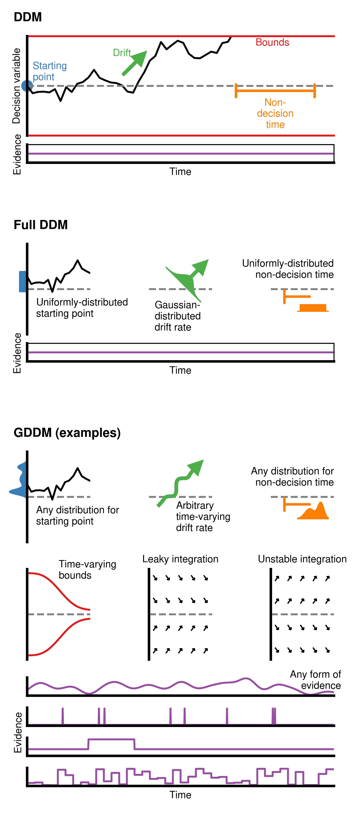

Gallery
=======

The following are examples showing the use of CanD in real publications.  They
will include quite a bit of non-CanD code as well, to illustrate how CanD can be
used in real life to create specific effects.

.. image:: ../_static/images/fokkerplanck.png
   :target: fokkerplanck.html

:ref:`modindex`

.. toctree::
   :maxdepth: 2
   :caption: Contents:

   ddmdiagram
   fokkerplanck
